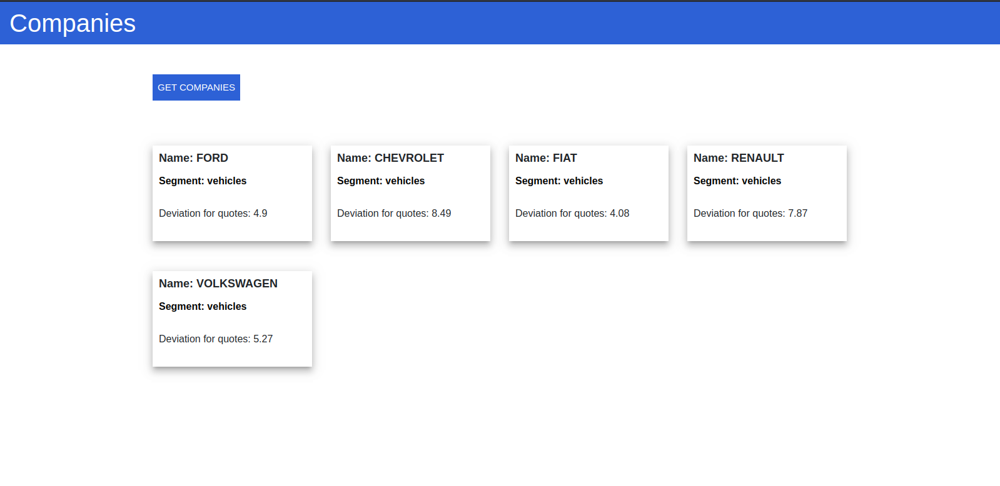

# Angular Frontend CompaniesApp

This project was generated with [Angular CLI](https://github.com/angular/angular-cli) version 8.3.23.

  

  

## Features

- **Angular** — Framework MVC JavaScript for build interfaces

- **Comunication Api Rest** - Use for json server mock a api rest.

- **Rxjs** - Use for RxJs in Services Requests

- **Cypress** - test EndToEnd in web aplication  

## Development server

Run  in /src/app/server/  `json-server --watch api.json
 for a mock api dev server [Json-Server](https://www.npmjs.com/package/json-server). Navigate To `http://localhost:3000/`

Run `ng serve`. Navigate to `http://localhost:4200/`. The app will automatically reload if you change any of the source files.

## Running end-to-end tests

Run `./node_modules/.bin/cypress open` or `npx open cypress` to execute tests e2e via [Cypress](https://www.cypress.io/).

## Code scaffolding

Run `ng generate component component-name` to generate a new component. You can also use `ng generate directive|pipe|service|class|guard|interface|enum|module`.

## Build

Run `ng build` to build the project. The build artifacts will be stored in the `dist/` directory. Use the `--prod` flag for a production build.

## Running unit tests

Run `ng test` to execute the unit tests via [Karma](https://karma-runner.github.io).

## Running end-to-end tests

Run `ng e2e` to execute the end-to-end tests via [Protractor](http://www.protractortest.org/).

## Further help

To get more help on the Angular CLI use `ng help` or go check out the [Angular CLI README](https://github.com/angular/angular-cli/blob/master/README.md).
